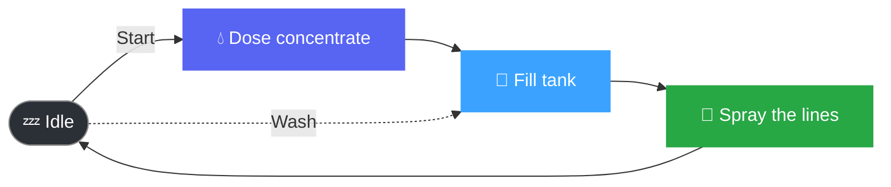
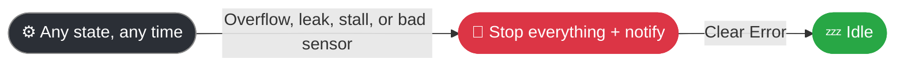

<div align="center">

# 🦟 ZanzNuke

### Automated anti-mosquito dosing, sprayed through your own irrigation system


**A little box that mixes an anti-mosquito product into water and sprays it
around the garden — automatically, on a schedule, while keeping an eye on
itself so it doesn't flood or run dry when nobody's watching.**

</div>

<br>

A Seeed Studio XIAO ESP32-S3 tucked into an enclosure next to your
irrigation valves, controlled entirely from your phone through its own
web page. No app to install, no account, no cloud — open your browser to
`zanznuke.local` and there it is.

<br>

## ✨ At a glance

| | |
|:--|:--|
| 📱 **Phone-controlled** | Self-hosted web page, works great on mobile, nothing to install |
| 🛡️ **Self-protecting** | Won't overflow, won't run the pump dry, catches leaks on its own |
| 📡 **No cloud, no account** | Lives entirely on your local network, reachable as `zanznuke.local` |
| ⏰ **Scheduled or on-demand** | Weekly calendar, a tap on the dashboard, or a physical button |
| 🔔 **Tells you when something's wrong** | Push notification the moment a fault is raised |

<br>

## 🌊 What it does



Ask it to run, and it doses a bit of concentrate, fills a small tank with
water to the amount you asked for, then pumps that mix out through the
irrigation lines until the tank runs empty again. How much concentrate
goes in is worked out automatically from how much water you're using,
based on a ratio you set once during calibration.

There's also a plain **Wash** cycle — the same fill-and-spray routine,
but with just water and no dosing, for flushing the lines out.

Trigger a run from the dashboard, from a physical button on the unit
itself, or just leave it on a weekly schedule and let it get on with it.

<br>

## 🛡️ Why it keeps itself in check

The whole reason this is "a controller" and not just a couple of relays
on a timer is that it watches its own sensors the entire time and refuses
to do anything that looks unsafe.



- 🌊 If the tank ever gets too full, **everything stops immediately** —
  it doesn't matter what the system was doing at that moment, an overflow
  always wins.
- 🚱 It won't run the pump dry. If the "tank empty" sensor doesn't agree
  there's actually water in there, it won't start — and if the tank runs
  empty mid-spray, the pump shuts off right then.
- 💧 It can tell the difference between a real leak or a stuck valve and
  the normal little dribble that happens for a second after a valve
  closes, so it doesn't cry wolf over nothing — but it still catches an
  actual leak quickly.
- 🌵 If the water's meant to be flowing and it isn't (mains off, valve
  stuck, sensor died), it notices and stops instead of running a dry pump
  for the next hour.
- 🩹 Bad or corrupted settings get caught and quietly repaired instead of
  causing something weird to happen.
- 📶 If it ever loses its WiFi connection for good, it tries to reconnect
  on its own, and if that doesn't work either, it restarts itself so it
  never just sits offline forever.

Whenever anything trips, it stops first and asks questions later — and
you'll get a push notification about it. Clearing the fault is always a
deliberate action: a button on the dashboard, or a physical button on the
board itself.

<br>

## 🚀 Getting it running

1. **Flash it** with [PlatformIO](https://platformio.org/):
   ```bash
   pio run -t upload
   ```
2. **Connect it to WiFi.** On first boot it won't know your network yet,
   so it starts its own hotspot called `ZanzNuke-Setup`. Connect your
   phone to it, a setup page pops up on its own (or go to
   `192.168.4.1`), and give it your home WiFi name and password.
3. **Find it on your network.** It restarts and joins your WiFi — from
   then on it lives at **`http://zanznuke.local`**, no IP-hunting
   required.
4. **Calibrate once.** On the Config page: how many pulses your flow
   meter gives per liter, and how many seconds of dosing per liter of
   water.
5. **Set a schedule, or just hit Start.**

> If it ever can't find your WiFi network anymore, it automatically goes
> back to broadcasting `ZanzNuke-Setup` on its own — no need to reset
> anything by hand.

<br>

## 📲 The web page

Built mobile-first — follows your phone's light or dark mode, nothing
loaded from the internet, nothing tracking you.

| Page | What's there |
|:--|:--|
| 🏠 **Home** | What it's doing right now, tank level, next scheduled run, and Start / Wash / Stop / Clear Error |
| ⚙️ **Config** | Water & concentrate amounts, safety timeouts, WiFi, push notifications — plus a tucked-away **Advanced** section for fine-tuning leak sensitivity and the like |
| 📅 **Schedule** | A normal weekly calendar with a time picker, up to three runs a day |
| 📊 **Status** | A look under the hood — sensor readings, what the safety checks are currently seeing, and a running log of what the device has been up to |
| 🧪 **Test** | Manually jog the pump, valve, or dosing pump for a few seconds to check the wiring, without needing a full cycle |

<br>

## 🔔 Notifications

Add a [Pushover](https://pushover.net/) token and user key on the Config
page and you'll get a phone notification the moment something goes
wrong — once per actual problem, never spammed on repeat.

<br>

## 📄 License

Personal project — no license file yet. Ask before reusing.

<br>

<div align="center">

*Built with 🦟 spite and an ESP32.*

</div>
