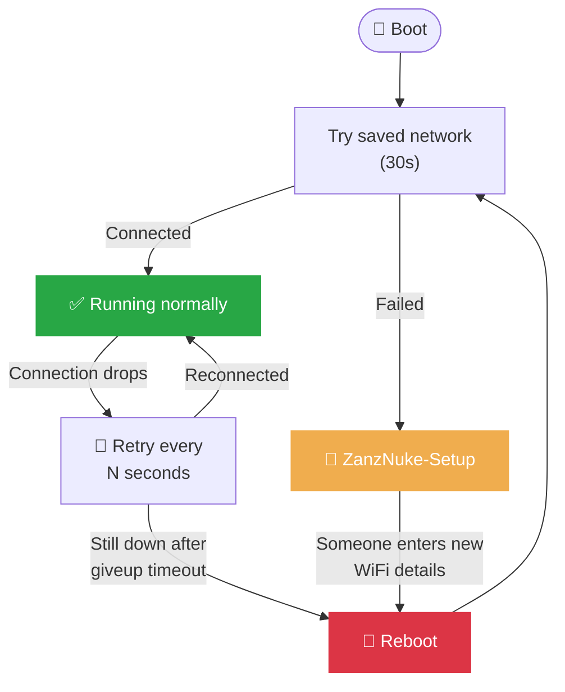
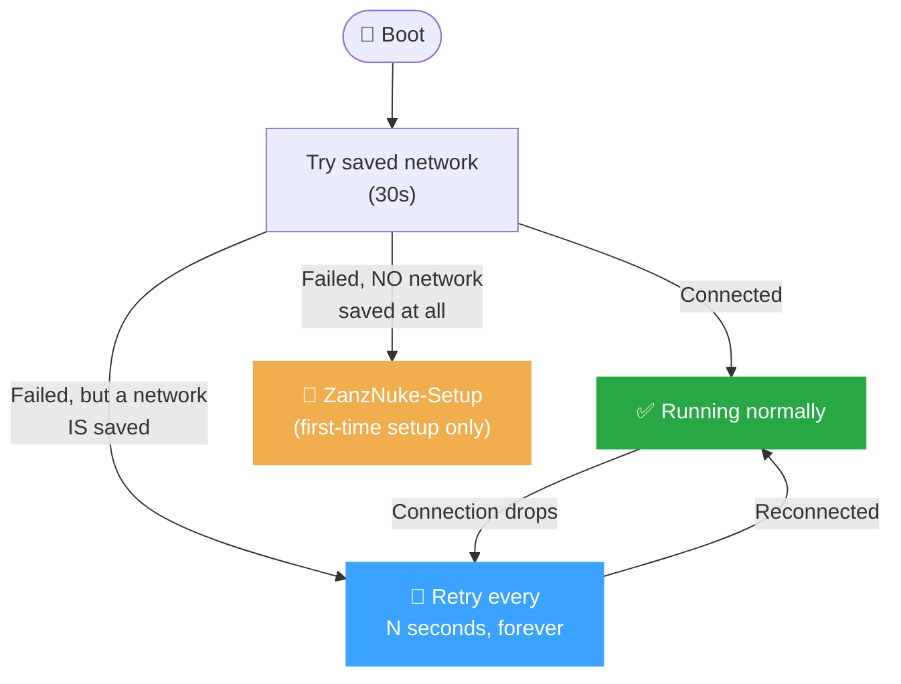

# WiFi behavior: Normal mode vs Networkless mode

ZanzNuke can run in one of two modes, set with the **Networkless mode**
toggle on the Config page (Advanced → Network). This document explains
exactly what changes between them, what never changes, and how to get
back into WiFi setup mode (`ZanzNuke-Setup`) from either one.

 

## The short version

| | **Normal mode** (default) | **Networkless mode** |
|:--|:--|:--|
| Assumes WiFi is... | Always available, a dropout is a fault | Occasional - a dropout is normal |
| Lost connection | Retries, then **reboots** after a timeout | Retries **forever**, never reboots over it |
| Can't reach saved network at boot | Falls back to **`ZanzNuke-Setup`** automatically | Keeps retrying quietly, **stays reachable to nobody** until it connects |
| Ends up in `ZanzNuke-Setup` on its own? | Yes, eventually, on any long outage | Never, unless there's no saved network at all |
| Irrigation, dosing, safety checks | Unaffected | Unaffected |
| Weekly schedule | Unaffected (runs off the internal clock) | Unaffected (runs off the internal clock) |
| Physical Start / Fault-Reset buttons | Unaffected | Unaffected |
| Push notifications while offline | Queued, sent on reconnect | Queued, sent on reconnect |
| Best for | A router that's basically always on | A phone hotspot, a weak signal, a network that comes and goes |

 

## Why this toggle exists

Falling back to `ZanzNuke-Setup` is *useful* - it's how you find and
reconfigure a device that's genuinely lost its network for good. But it
has a real cost: while broadcasting `ZanzNuke-Setup`, the full web
dashboard is unavailable, and the device's clock resets on every reboot
and can't resync without internet access - so **the weekly schedule
silently stops firing** until someone notices and reconnects it by hand.

For a network that's only *sometimes* there by design, that automatic
fallback does more harm than good: it turns an expected, harmless gap
into a reason to stop scheduling irrigation runs. Networkless mode
trades away the automatic recovery-and-discoverability safety net in
exchange for never letting a WiFi gap interrupt the schedule.

 

## Normal mode, step by step

A sustained outage always ends the same way in Normal mode: reboot,
try again, fail again, broadcast `ZanzNuke-Setup`. That's the built-in
safety net - but it also means the schedule pauses for as long as the
device sits there waiting for someone to reconnect it.

*(Setting "Restart device after WiFi down for" to `0` disables just the
reboot-on-timeout part of this, without changing anything else -a
lighter-weight, manual version of what Networkless mode does globally.)*

 

## Networkless mode, step by step

No matter how long the outage, it just keeps retrying - no reboot, no
`ZanzNuke-Setup`, no interruption to anything the device is doing.
The one exception is a **brand-new device with nothing saved yet**:
there's no network to retry, so it still needs the setup AP to get
its first-ever credentials.

 

## What never changes, in either mode

These never check WiFi state at all, so none of this is affected by
which mode you're in - or by whether WiFi is connected in the first
place:

- 💧 **Dosing → Fill → Spray cycle** - the whole irrigation state machine
- 🛡️ **Every safety check** - overflow, dry-run, leak/stall detection, impossible-sensor-state
- ⏰ **The weekly schedule** - runs off the device's own internal clock,
  which keeps ticking on its own between syncs (only a *reboot* resets it -
  see below)
- 🔘 **Both physical buttons** - manual start, and fault-reset (short press)
- 🔔 **Push notifications** - if one can't be delivered, it's queued
  (up to 10) and sent automatically, in order, the moment a connection
  comes back - in both modes

The schedule only actually goes silent when the clock is invalid - and
the clock only goes invalid right after a *reboot* that hasn't yet had a
chance to sync over the network. Networkless mode helps here mainly by
avoiding the automatic reboots Normal mode would otherwise trigger; a
reboot for some *other* reason (power loss, a crash, a manual power
cycle) will still leave the schedule paused until the network comes
back, in either mode.

 

## Getting back to `ZanzNuke-Setup` on demand

Since Networkless mode never falls back to the setup AP on its own,
there has to be a manual way in - and it works identically in **both**
modes, whenever you need it:

| Situation | What to do |
|:--|:--|
| Device is currently reachable | Config page → WiFi card → **"Enter WiFi Setup Mode Now"** (asks for confirmation, then reboots straight into `ZanzNuke-Setup`) |
| Device is *not* reachable (e.g. quietly retrying a dead network in Networkless mode) | Hold the physical **fault-reset button for 5 seconds**. LED flashes yellow, then it reboots into `ZanzNuke-Setup` |

Either way, this is a **detour, not a reset**: your saved SSID and
password are left untouched. If you enter setup mode and back out
without saving new credentials, the next reboot just goes back to
trying the old network normally.

 

## Where the toggle lives

Config page → **Advanced** (bottom of the page, tap to expand) →
**Network** card → **Networkless mode** checkbox. Saved like every
other setting, survives reboots and power loss.
